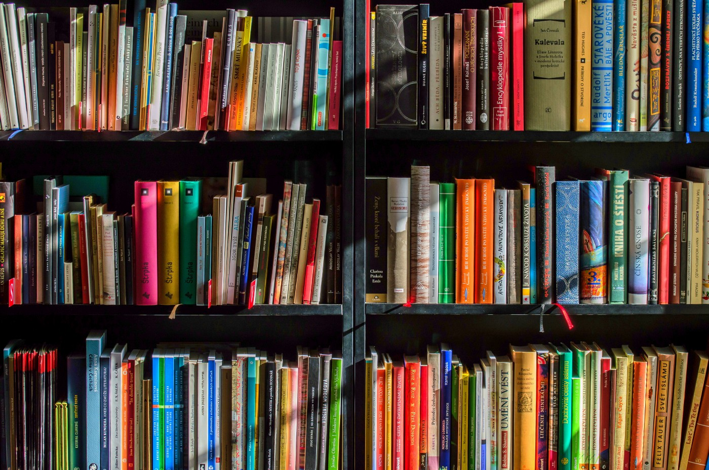

2017 foi um ano que li uma quantidade boa de livros, principalmente por causa da longa viagem de casa ao trabalho que enfrentei durante alguns meses, mas mesmo assim, como em todo ano, penso que não foram tantos livros como gostaria que fossem, afinal, existe um mundo de literatura e tão pouco tempo disponível para ler.

Aqui falo um pouco sobre os livros que mais gostei de ler ao longo do ano. Coloquei os livros pela ordem quem li e não por algum tipo de classificação.

---

## História do Futuro: O Horizonte do Brasil no Século XXI — Miriam Leitão

Logo no início do ano me surpreendi com a leitura deste livro. Se não me engano, peguei gratuitamente, ou bem barato, numa promoção da Amazon, e lembro de ler ele em pé nas minhas primeiras viagens de metrô para o novo trabalho.

Neste livro, a jornalista Miriam Leitão faz um apanhado de problemas, soluções e histórias, que podem levar o Brasil a trilhar um caminho melhor para o futuro.

Achei a leitura agradável e aprendi bastante coisa sobre temas que não conhecia muito, como o desmatamento da Amazônia e a situação dos indígenas no Brasil.

## O Último Reino — Bernard Cornwell

Já havia lido dois livros do Bernard Cornwell há tempos: o primeiro livro da trilogia do Graal, O Arqueiro, e o primeiro livro da série do Sharpe. Gostei dessas leituras, mas não me pegaram a ponto de emendar todo resto dessas duas séries, que por sinal, nunca terminei. Lembro de achar que em termos de romances históricos, Bernard Cornwell fica bem atrás de Ken Follett (fãs do Cornwell que me perdoem). Mas a leitura de O Último Reino, o primeiro volume das Crônicas Saxônicos, me pegou de jeito. Rapidamente estava envolvido pelo personagem principal. A leitura é simples e ágil o que contribuiu para que eu não conseguisse parar de ler este livro e rapidamente o terminasse.

A saga acompanha a história de Uthred, um menino saxão criado por invasores Vikings que cresce e vê-se envolvido em batalhas que moldaram a história da Inglaterra.

Depois de ler este primeiro livro da série, li mais três ao longo do ano, e todos mantém um excelente ritmo.

## Churchill: Uma Vida — Martin Gilbert

Churchill é uma figura polêmica, mas mesmo assim é uma das grandes figuras da história moderna. Participou ativamente da política Britânica desde o início do século XX e foi o Primeiro-Ministro durante a Segunda Guerra Mundial, exercendo um papel fundamental no conflito. Em 2002, numa pesquisa realizada pela BBC, foi eleito o maior Britânico de todos os tempos.

Esta biografia é escrita pelo biógrafo oficial de Churchill, Martin Gilbert, e foi lançada no Brasil em dois volumes. O primeiro trata da vida de Churchill até os anos anteriores à Segunda Guerra Mundial e o segundo daí para frente, até o fim de sua vida.

Eu já conhecia razoavelmente a história de Churchill como Primeiro-Ministro, mas foi excelente e inspirador conhecer todos os seus feitos e polêmicas desde jovem. Inegavelmente, Churchill foi uma grande figura e essa foi uma das melhores biografias que já li, apesar de achar que em alguns momentos o autor foi um pouco parcial, favorecendo decisões de Churchill.

## Deuses Americanos — Neil Gaiman

Essa era uma leitura que há bastante tempo eu estava de olho. Já havia lido um pequeno livro de Gaiman, O Oceano no Fim do Caminho, além de parte da HQ Sandman, e virei fã do autor.

Deuses Americanos é a obra mais conhecida de Neil Gaiman e é basicamente uma road trip pelos Estados Unidos, mostrando o personagem principal, Shadow, envolvido em uma trama com deuses que vivem entre nós.

A história é incrível e envolvente, o que me fez ler rapidamente este livro e ficar curioso para ler os outros que se passam nesse incrível universo criado por Gaiman.

## J.R.R. Tolkien: O Senhor da Fantasia — Michael White

Sou um grande fã de Tolkien e conheço relativamente bem sua história, mas esta biografia (que possui uma edição linda pela DarkSide Books) me fez conhecer mais detalhes e ficar com vontade de reler toda sua obra (o que por sinal comecei a fazer).

O autor é um pouco passional, visivelmente um grande fã de Tolkien, mas isso não atrapalha muito e o livro conta de forma bem acessível toda a sua vida, a concepção e criação da Terra-Média, do Hobbit e do Senhor dos Anéis, seus relacionamentos com a família, com os amigos, o reconhecimento de sua obra e sua velhice.

## Submissão — Michel Houellebecq

Michel Houellebecq é um polêmico escritor francês e Submissão é um livro mais polêmico ainda. Ele foi lançado na semana em que houveram os ataques ao Charles Hebdo, quando Houellebecq perdeu amigos que trabalhavam no jornal. Além disso, o próprio tema do livro é polêmico, pois trata de um futuro próximo onde um partido muçulmano ganhou as eleições na França e muda a cara do país, acompanhando a história pelos olhos de François, um professor universitário desiludido.

O livro trata sobre a submissão da população, a futilidade do povo, que vê diante de seus olhos a mudança. François também é um personagem polêmico. Machista e fútil, apesar de ser um professor universitário em uma conceituada universidade, François mostra pouca preocupação com o seu país e com as pessoas, a não ser ele próprio.

Gostei muito da escrita e estilo de Houellebecq e espero ler mais livros do autor.

## Fúria Vermelha — Pierce Brown

Este livro foi uma grata surpresa no fim de ano. Ganhei no início de 2017 a versão digital em uma promoção da Amazon, mas não animei de ler, já que não sou grande fã de distopias, ainda mais as surgidas após Jogos Vorazes e que aparentam ser quase todas iguais.

Dei chance ao livro. A história se passa num futuro onde os seres humanos povoaram o Sistema Solar e a sociedade é totalmente estratificada por classes que possuem cores representado-as. Na trama, acompanhamos a história de Darrow, um jovem Vermelho de Marte, a classe mais baixa de todas.

No início achei que estava lendo uma versão genérica e espacial de Jogos Vorazes, e quase abandonei a leitura. Mas aí a trama traz uma virada inesperada. O ritmo acelera e o personagem principal cativa. No fim, acabei gostando bastante. É um livro simples de ser lido, acessível à qualquer um e com um boa trama. Já comecei a leitura do segundo volume.

##### Agora, que venham as leituras de 2018!