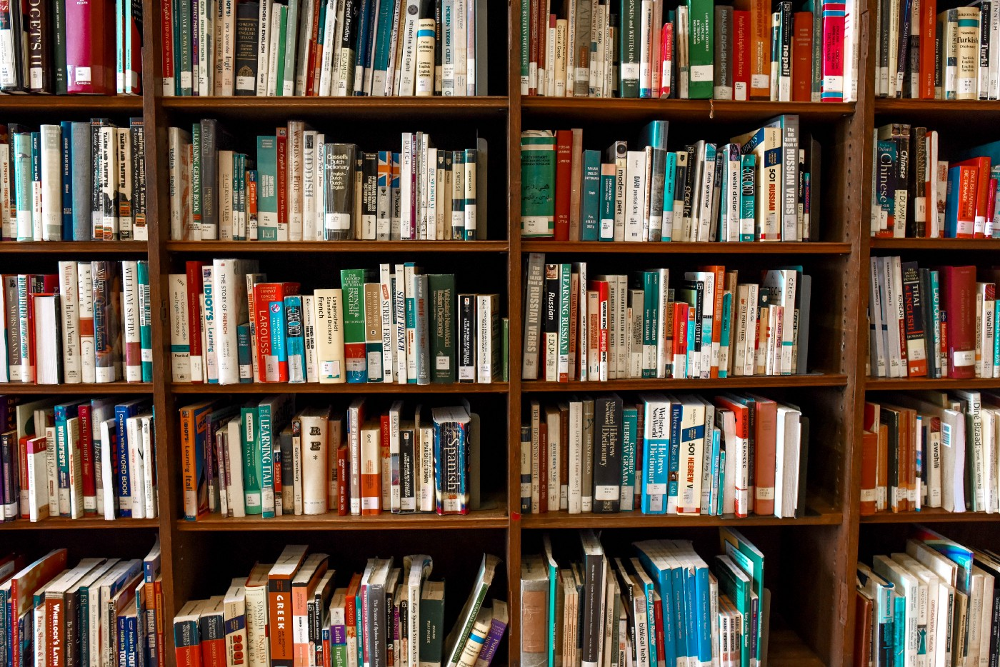

Segundo ano escrevendo sobre os melhores livros que li. Esse ano não li tanto quanto o ano passado, principalmente porque não há mais as longas viagens ao trabalho (e não tenho tanta disciplina pra converter todo tempo economizado em leitura… obrigado Netflix…) e também porque peguei alguns livros que me fizeram passar alguns meses preso neles.

Tentei focar em alguns clássicos que nunca havia lido e coloquei como meta ler o máximo possível da lista de 100 clássicos da literatura mundial da Revista Bravo.

A lista está pela ordem que li, e não pelos quais mais gostei.

---

## A Morte do Pai — Karl Ove Knausgård

Essa foi minha primeira leitura do ano e talvez tenha sido a melhor. A Morte do Pai é o primeiro livro da série de autoficção Minha Luta, do escritor norueguês Karl Ove Knausgård, que tem feito grande sucesso em todo mundo.

Nesse primeiro livro passamos por diversos momentos da vida dele, mas focado principalmente na relação com seu pai e sua morte, com o autor já adulto.

No início da leitura, achei que o ritmo lento não me prenderia, mas logo me identifiquei bastante com o personagem/autor e me vi totalmente preso ao livro.

Ainda não li nenhum outro da série, mas espero fazer isso logo.

## Do que Eu Falo Quando Eu Falo de Corrida — Haruki Murakami

Talvez esse não seja um livro que agrade muitas pessoas, nem considerado um dos melhores do Murakami, ainda mais sendo um livro de não-ficção, mas o tema principal são duas coisas que muito gosto: corrida e escrita.

Nessa obra, escrita nos meses de treinamento que precederam a participação do autor na Maratona de Nova York, Murakami fala sobre a corrida, sobre a importância dela na sua vida, sobre como começou a escrever, sobre seu processo de escrita e em como a corrida o ajuda nesse processo.

A forma em como ele descreve as sensações de correr são perfeitas.

Ainda não li outro livro do Murakami, mas depois deste, espero ler algum em 2019.

## Moby Dick — Hermam Melville

Esse divide o livro de melhor leitura do ano junto com A Morte do Pai. Foi um livro que deu certo medo de começar a ler. Não é um livro curto e já ouvi dizer bastante que não é uma leitura fácil, mas é um clássico que sempre quis ler.

O livro narra a perseguição do capitão Ahab à famosa baleia branca, Moby Dick, que lhe arrancou a perna, contada pelo tripulante Ishmael.

Para minha surpresa, o início do livro não tem nada de difícil, pelo contrário, chega a ter um tom leve e brincalhão. Mas, aos poucos, a coisa muda. Há muitos capítulos sobre os tipos de baleias, sobre as técnicas de caça e sobre a extração do óleo, e isso faz com que a leitura acabe se arrastando um pouco, apesar de eu ter achado bem interessante. A obsessão e loucura de Ahab crescem ao longo do livro, e, junto com os pequenos sinais de morte, o livro torna-se mais denso.

Achei os personagens incríveis: Ishmael, Queequeg, o capitão Ahab e seus imediatos.

Acabei a leitura e continuei pensando no livro, e em fazer uma releitura em algum momento. Realmente é um clássico que vale todo o esforço para se ler.

## O Velho e o Mar — Ernest Hemingway

O que falar sobre esse curto livro? É uma leitura tão bela, leve, incrível. Não há motivos para não ler esse livro. Me arrependo de nunca ter lido antes, pois gostei tanto que não satisfeito tendo lido em português, peguei o original em inglês para ler na sequência.

O livro conta a história de um velho pescador e uma ferrenha disputa com um grande marlim.

A escrita de Hemingway é algo incrível. As palavras são perfeitamente escolhidas, as frases são perfeitamente ordenadas. Enfim, acredito que a melhor forma de dizer é dizer que é uma leitura linda.

Por favor, leia esse livro.

## Sapiens: Uma Breve História da Humanidade — Yuval Noah Harari

Esse livro chega a estar batido de tanto que tem sido recomendado e elogiado nos últimos anos. E realmente achei uma grande leitura.

Como o título diz, o livro se propões a contar a história da humanidade, desde seu surgimento, e até pincela um pouco sobre o futuro.

Já havia lido outros livros na mesma linha como, por exemplo, o Uma Breve História do Mundo. Mas nenhum se compara à Sapiens.

O autor traz as informações de forma muito bem escrita, colocando um tom pessoal sem deixar que ele atrapalhe o conteúdo passado. O livro traz luz à assuntos importantes e atuais, como o feminismo, capitalismo, entre outros.

A leitura é bem acessível e leve, o que mais ainda beneficia o livro.

Outro livro do autor já segue nas listas de mais vendidos, Homo Deus. Vou tentar lê-lo em 2019.

## Madame Bovary — Gustave Flaubert

Mais um clássico nessa lista. Madame Bovary conta a história de Emma Bovary, sua insatisfação constante com o casamento e seus casos extra conjugais.

Admito que essa leitura demorou a fluir e me deixar preso. Parecia tudo muito lento no início e eu não estava gostando do livro. Mas, quando mal me dei conta, já estava ansioso por voltar às páginas e saber o que aconteceria, de maneira que a segunda metade do livro passou rapidamente.

No fim, me peguei pensando na história, nos personagens, na infelicidade de Emma, na inocência e tristeza de Charles, e em como o livro foi belamente escrito.

Não é uma leitura das mais fáceis, mas também não achei um bicho de sete cabeças como muitas vezes tendemos a achar de um clássico.

---

 

Li tantos livros bons que poderia elencar mais, mas acredito que os destaques ficam para esses.

Agora, que venha 2019!

Leia também: [Melhores Livros de 2017](melhores-livros-2017)