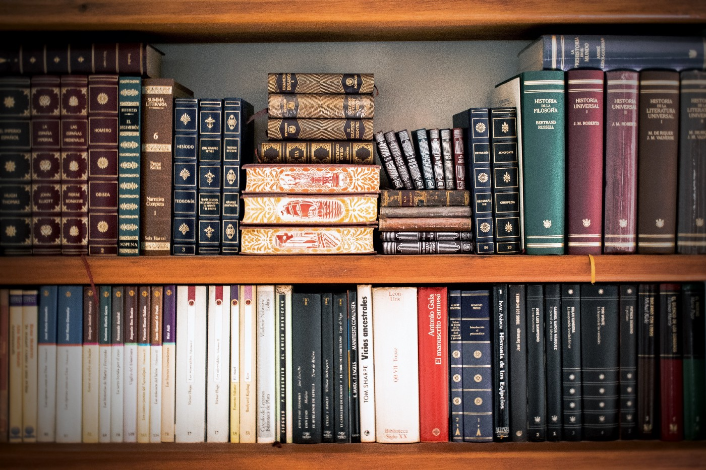
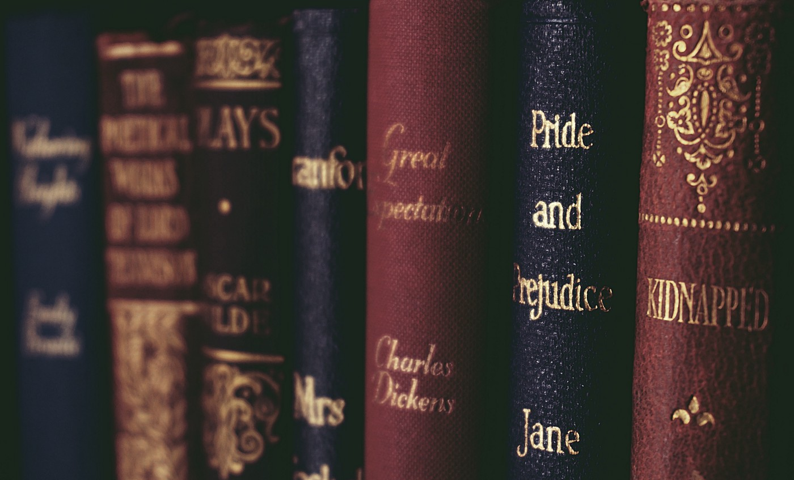

Apesar de sempre ter lido bastante, durante muitos anos fugi de leituras clássicas, por puro preconceito, taxando os clássicos da literatura como leituras maçantes e difíceis. Já há alguns anos, mudei meus hábitos e gostos literários, e tenho lido bastante deles.

Mas por que ler clássicos? Eles realmente são leituras difíceis? O que ganhei como leitor, como pessoa, lendo-os?

Alguns realmente são leituras difíceis, não há como negar. Mas, fazendo uma analogia com exercícios físicos, ler é como ir para a academia. Se você não tem o hábito da leitura, não deve começar lendo algo complicado, da mesma maneira quando, ao entrar em uma academia, já não começa fazendo muitos pesos ou muitos exercícios. Ao manter uma rotina de leitura, lendo com frequência, você consegue compreender e assimilar mais rápido. Então você parte para um livro mais complicado. No início fica difícil, mas logo você volta a ler no ritmo da leitura anterior. Quando você treina sempre, os pesos leves ficam fáceis de levantar. Quando você lê clássicos, ao pegar um livro mais novo, de linguagem mais acessível ou assunto mais leve, a leitura fica mais fácil, mais prazerosa. **Você se torna um leitor melhor.**

Muitos clássicos nunca foram *best-sellers* em suas épocas. Então, por que assim são considerados? Além da importância histórica, normalmente são obras que abordam questões humanas atemporais, nossas inseguranças, nossos dilemas, nossos problemas. Ao lê-los, você está aprendendo, você vê que muitas coisas que te afligem não são apenas suas, mas de toda humanidade. Você passa a pensar sobre essas questões com outros pontos de vista. **Você se torna não só um leitor melhor, mas uma pessoa melhor.**

Então, por onde começar? Como eu disse, alguns clássicos são leituras difíceis, mas nem todos. Alguns são curtos e simples. Você pode ler, por exemplo, **O Velho e o Mar**, de Hemingway, um livro curto, lindo, e que possui pouco mais de 100 páginas, ou alguma obra mais curta de Dostoiévski, como **Gente Pobre**. **O Estrangeiro** de Camus é bem acessível. Apesar de tratar do ponto central da filosofia de Camus, o absurdo, a leitura é simples e possui cerca de 100 páginas. Provavelmente você já leu Machado de Assis, mas mesmo assim, vale a pena reler **Dom Casmurro** ou **Memórias Póstumas de Brás Cubas**, que são dois grandes clássicos da literatura brasileira.

Deixo a recomendação também de **Cem Anos de Solidão**, do Gabriel García Márquez. Apesar de ser um livro maior, a leitura é tranquila, e quase todos que lêem se apaixonam pela obra.

Para me ajudar a escolher o clássico da vez, uso a lista de **100 Livros Essenciais da Literatura Mundial**, feito pela **Revista Bravo**. A lista é excelente e se você conseguir acesso à revista, onde as obras são explicadas e sua importância levantada, melhor ainda.

Então, não tenha medo ou preconceito. Pegue um clássico para ler.