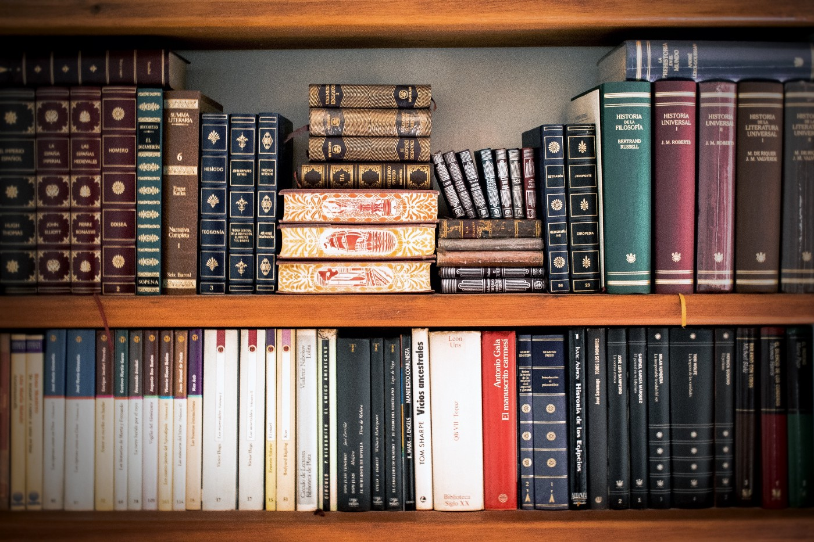

Terceiro ano escrevendo aqui sobre minhas leituras. Coloquei uma meta ambiciosa em relação ao quanto queria ler em 2019 e consegui cumpri-la. A leitura requerida para a faculdade de filosofia que faço acabou dificultando ler muitos livros, mas no geral foi um bom ano literário.

Continuo me esforçando para ler clássicos da literatura mundial, usando como referência a lista de *100 clássicos da literatura mundial da Revista Bravo*.

A lista das melhores leituras abaixo segue apenas a ordem em que li, e não a ordem de quais considerei melhores.

---

## Nada — Carmen Laforet

No final de 2018, assinei a [TAG Curadoria](https://taglivros.com/curadoria), um clube de livros que todo mês te envia uma obra indicada por alguma pessoa do meio literário/artístico não só brasileiro, mas até de outros países. Esse foi o primeiro que recebi e foi uma grata surpresa, pois foi uma leitura incrível.

**Nada**, da escritora espanhola **Carmen Laforet**, foi lançado em 1945 e conta a história de Andrea, uma jovem que, depois da Guerra Civil Espanhola, se muda para a casa da avó em Barcelona para estudar na universidade. Ali, ela se vê cada vez mais solitária, vivendo no meio de uma família totalmente disfuncional, com brigas, intrigas e ameaças.

Ao longo da leitura, consegui sentir a solidão e a tristeza de Andrea. O sentimento de inadequação dela, no meio de uma família muito complicada, é sensível durante a leitura.

Achei a escrita muito bonita, mas ao mesmo tempo triste. Terminei essa leitura e ainda fiquei um bom tempo com a história na cabeça.

## Cem Anos de Solidão — Gabriel García Márquez

Essa é uma dívida de leitura que eu tinha comigo mesmo. **Cem Anos de Solidão** é um clássico da literatura mundial que sempre me foi muito recomendado e sempre quis ler. Finalmente paguei a dívida.

O que falar desse livro? Acredito que foi uma das melhores leituras que já fiz na vida, daquelas que provavelmente farei de novo ao longo dos anos.

A história acompanha a saga da família Buendía, desde a fundação da cidade que criaram, Macondo, até o seu fim, durante cerca de cem anos.

A escrita de García Márquez é fluída, leve, e mesmo quando há muitas informações, grandes parágrafos cheios de descrições, você ainda se vê preso, querendo continuar lendo sem parar.

Ao longo da leitura, fui me envolvendo cada vez mais na saga dos Buendía, nas suas tristezas e na sua solidão. A leitura flui sem dificuldade nenhuma.

Tive medo pelo final. Depois de ler um livro tão incrível, sempre fico inseguro de haver um final decepcionante. Mas em Cem Anos de Solidão não é esse o caso. O final é simplesmente lindo. Fiz questão de reler mais de uma vez as últimas páginas.

Se você ainda não leu, pague sua dívida consigo mesmo, e leia Cem Anos de Solidão.

## A Velocidade da Luz — Javier Cercas

Mais um livro enviado pela TAG Curadoria que entra na minha lista. E por coincidência, mais um de um escritor espanhol, mas agora de um contemporâneo.

**A Velocidade da Luz** parece uma autoficção e pelo que li, **Cercas** realmente coloca coisas de sua vida nesse livro. A história acompanha um jovem escritor espanhol que passa um tempo como professor nos Estados Unidos e lá conhece outro professor chamado Rodney, um homem misterioso e solitário. Logo eles ficam amigos e descobrimos que Rodney tem um passado perturbador na Guerra do Vietnã.

O livro me deu sensações mistas. Achei um pouco confuso e corrido em alguns momentos, mas no fim foi uma leitura marcante. A história acaba sendo a descoberta de um escritor, dos motivos de escrever, de por quê escrever. O final do livro foi muito bom, mas, sem o desenvolvimento, não haveria como ter esse incrível término.

O estilo de escrita de Cercas é muito interessante, bonito e ao mesmo tempo simples e direto. Fiquei bastante curioso para ler mais coisas do autor.

## Laranja Mecânica — Anthony Burgess

No fim do ano li vários livros interessantes e **Laranja Mecânica** foi um deles. Nunca havia visto o filme do **Kubric**, pois sempre fiquei na cabeça de ler o livro primeiro.

Enfim, depois de ler o livro, também assisti o filme. E, na minha opinião, apesar do filme ser muito bom, um clássico do cinema, o livro é bem melhor.

Na história que se passa numa Londres distópica, acompanhamos o jovem Alex e sua gangue, que praticam diversos atos de violência livremente. Em certo momento, Alex acaba preso, e na prisão passa por um método chamado de "método Ludovico", que faz com que ele não consiga mais praticar qualquer tipo de violência, mas junto acaba tirando um de seus maiores prazeres, ouvir música clássica.

O livro é de fácil leitura e a história envolve. Um dos pontos mais interessantes é a linguagem usada pelos jovens, o Nadsat. O uso dessa linguagem traz uma sensação de estranhamento que te coloca mais ainda dentro da história. Como o tradutor da última edição brasileira recomenda, também recomendo ler sem ficar procurando no glossário o significado das palavras, afinal, essa foi a intenção do escritor, justamente causar esse estranhamento.

Gostei bem mais do final esperançoso do livro, do que o final negativo do filme do Kubric.

## As Cavernas de Aço — Isaac Asimov

Apesar de grande fã de ficção científica, nunca havia lido nada do **Asimov**, e acabei lendo esse livro bem por acaso. Já no fim de ano, recebi uma promoção da Amazon na qual você podia escolher gratuitamente um e-book de uma lista que eles passaram, e o que mais me chamou a atenção dessa lista foi **As Cavernas de Aço**.

No livro acompanhamos uma investigação de um assassinato, na qual o detetive, humano, se vê obrigado à trabalhar com um parceiro robô, sendo que o caso envolve sérias questões políticas e diplomáticas.

Achei o livro incrível. A escrita de Asimov é leve e o livro rapidamente avança. Toda a trama e a reviravolta foram sensacionais. A forma como o cenário é montado, as questões diplomáticas entre diferentes planetas, a questão dos robôs, tudo é trabalhado muito bem, o que acaba gerando uma grande curiosidade e uma grande vontade de ler mais histórias nesse universo.

Já estou com a trilogia **Fundação** preparada para ler em 2020.

---

 

Li vários livros clássicos em 2019 que quase coloquei na lista, como **O Estrangeiro** de **Camus**, **Metamorfose** do **Kafka**, **O Apanhador no Campo de Centeio**, mas acabei preferindo colocar os 5 que mais me empolgaram.

Abaixo deixo os links para os melhores livros que li em 2017 e 2018. Até o próximo ano de leituras!

- [Melhores Livros que Li em 2018](melhores-livros-2018)

- [Melhores Livros que Li em 2017](melhores-livros-2017)