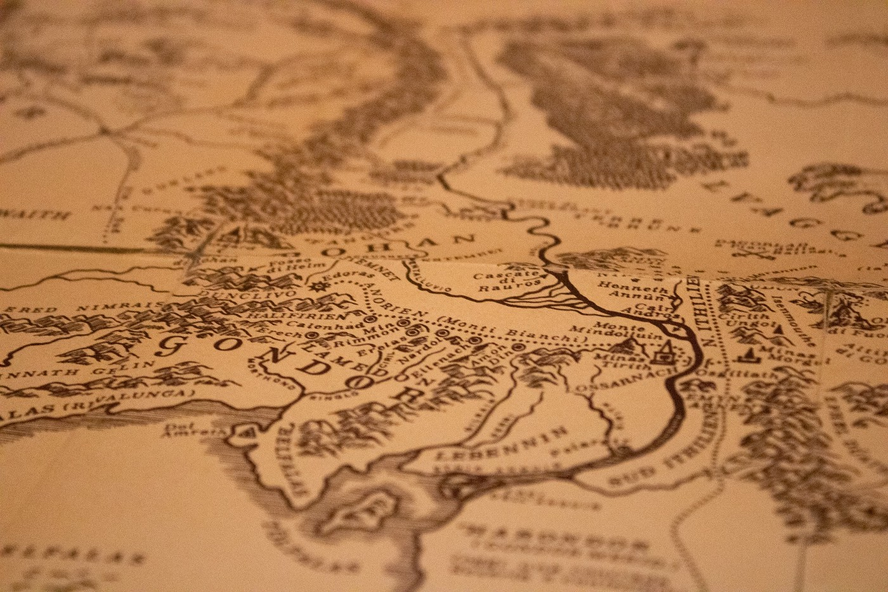

Acho que eu tinha doze anos. Não conhecia a história, não sabia que era um livro, nem sabia nada sobre Tolkien. Assisti a um trailer na TV e pensei que aquele filme deveria ser incrível. Então, fui eu com um amigo da escola ao cinema. Meus pais nos levaram até lá.

Lembro que assistir O Senhor dos Anéis foi uma experiência marcante. As quase três horas de filme passaram sem eu perceber, sem ser cansativo mesmo para uma garoto de doze anos. Eis que o filme acaba, mas não a história. Frodo e Sam partiam juntos rumo à Mordor, enquanto Aragorn, Legolas e Gimli começavam sua caçada aos orcs (ou orques na nova tradução) que capturaram os outros dois Hobbits.

Como eu esperaria um ano pelo desfecho daquela história incrível? Como esperar para novamente estar naquela terra fantástica?

Enquanto saíamos do cinema e eu reclamava inconformado do não-final, meu colega falou:

— Mas você pode ler o livro.

— Livro!? Como assim?

— É. Esse “O Senhor dos Anéis” é um livro. Meu pai já leu.

O convenci então, antes de ir embora, a passarmos em uma livraria. Lá, na vitrine, já havia uma edição volume único, com a capa do próprio filme. O livro era gigante, mais de mil páginas. Como eu poderia ler aquilo? E pior ainda era o preço. Não lembro o quanto era, mas lembro que era uma quantia absurda para ser dada em um livro para alguém da minha idade. Mesmo assim, queria ler.

Uma grande felicidade que tive desde minha infância, foi o estímulo que meus pais me deram à leitura. Pedi para o meu pai e alguns dias depois ele voltou do trabalho com um pacote de uma antiga livraria lá de Niterói, com aquele livro de mais de mil páginas e a capa do filme.

Como posso explicar como foi ler O Senhor dos Anéis pela primeira vez? Foi difícil? Foi. Alguns capítulos eram cansativos, muita descrição, pouca ação, mas a sensação de estar na Terra Média, naquele lugar mágico, cheio de histórias e línguas, era algo fantástico. Não só o enredo te deixa interessado, mas a sensação de que existe um passado, uma história, povos diferentes, culturas diferentes, é impactante. Como Tolkien criou tudo aquilo?

Minha leitura não parou por aí. Ao longo da minha adolescência li O Hobbit, O Silmarillion, Contos Inacabados. Quando estava na faculdade, foi lançado o Children of Húrin e como ainda não havia tradução em português, me aventurei na edição de língua inglesa. Reli O Senhor dos Anéis, reli o Silmarillion. Voltar à Terra Média sempre era fascinante, e sempre era diferente.

Tolkien e suas histórias me estimularam não só à ler, mas a desenvolver minha imaginação, aprender outras línguas.

Em 2018 li mais uma vez O Senhor dos Anéis. Novamente foi uma leitura marcante, mas as coisas parecem um pouco diferentes. Consigo ler com mais calma, aproveitar detalhes que antes eram chatos. Ao mesmo tempo, nem tudo é tão grande e fantástico como já foi um dia em minha mente.

Tolkien sempre volta à minha vida. Grande parte da minha vontade de ler e escrever vem de sua influência. Grande parte de minha curiosidade também.

Agora, em 2020, ele veio novamente aos meus pensamentos, pois saíram as novas traduções de O Senhor dos Anéis no Brasil. Havia acabado de comprar o Hobbit, também com nova tradução, em uma bela edição de capa dura, quando saiu a notícia da morte de Christopher Tolkien, o filho de J.R.R. Tolkien, notícia essa que me deixou bem triste. Christopher era o principal responsável por lançar as obras do pai. Sem ele, nada depois do Senhor dos Anéis haveria de ser lançado. Agora, dificilmente teremos novas obras, mas graças à ele, o grande legado literário do seu pai, com muitas histórias sobre a Terra Média, está disponível.

Tenho certeza que lerei Tolkien mais vezes. E tenho certeza que novamente entrarei em um mundo fantástico, mesmo que com o passar dos anos, meu olhar seja diferente, os detalhes sejam diferentes, talvez até a Terra Média seja diferente em minha imaginação. Mas ela sempre estará lá, disponível naquelas páginas escritas por um professor inglês há mais de 50 anos.

---

 

Leia também: [Melhores Livros que Li em 2019](melhores-livros-2019)