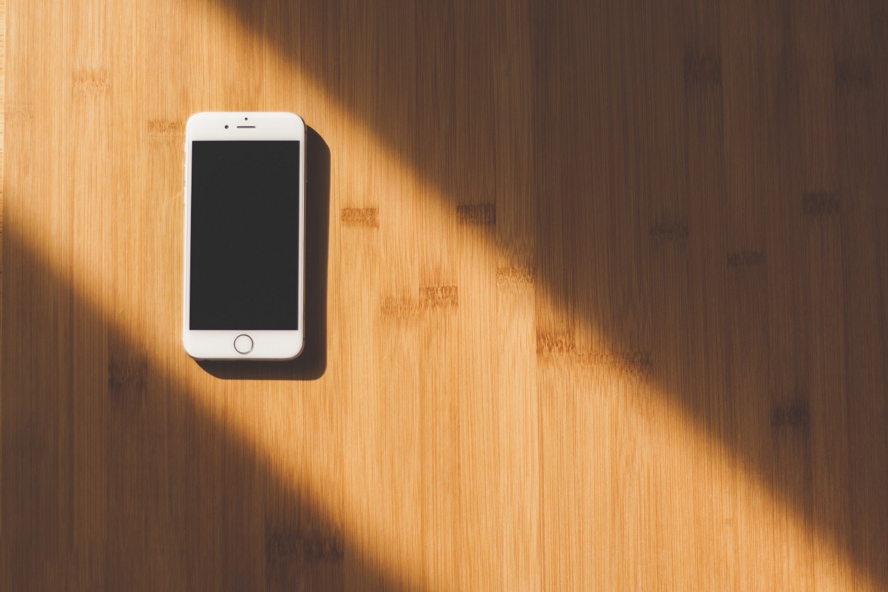

Um dia desses alguém compartilhou um meme que perguntava como seria a quarentena durante a pandemia se só tivéssemos o famoso “jogo da cobrinha” no celular. E aí fiquei realmente me perguntando como seria. Melhor, como seria a quarentena se não tivéssemos celulares? Como que lidaríamos com o tempo disponível que é consumido por nossos aparelhos, seja pelo WhatsApp, seja pelo Instagram, notícias, etc?

Talvez as pessoas vissem mais TV? Mas e se tirássemos o Netflix? Melhor ainda, e se a pandemia se passasse nos anos 80, o que as pessoas estariam fazendo, ainda mais em um período mais rigoroso do isolamento, quando praticamente ninguém saía de casa?

Talvez conversássemos mais, mesmo que por telefone? Não aquela conversa assíncrona de WhatsApp, mas conversas reais, conversas nas quais precisamos ouvir nossos amigos enquanto eles falam, depois falar, ouvir de novo, rir, ouvir a risada do outro, conectar mais com o outro. E com os que moram com a gente? Falaríamos de assuntos mais relevantes? Discutiríamos mais sobre problemas e dificuldades que nos afligem, ao invés de esperar tudo chegar a um limite? Conheceríamos uns aos outros melhor do que só o que é exposto nas redes sociais?

Leríamos mais livros, revistas? O tédio nos faria pegar aquele livro que há meses queremos ler, mas que adiamos porque sempre que nos vemos por 30 segundos na inércia, já corremos para o celular e nos distraímos rolando algum tipo de feed?

Conheceríamos a nós mesmos melhor? Pensaríamos mais, refletiríamos mais, questionaríamos mais? Seríamos mais criativos? Ou apenas teríamos dias e mais dias de um grande tédio, maior ainda do que o que já passamos, mesmo tendo os celulares na mão?

Será que estamos todos viciados em nossos celulares? Ou sou apenas eu?

---

 

Para mais reflexão: [Almoço, Celular e Solidão](almoco-celular-e-solidao)