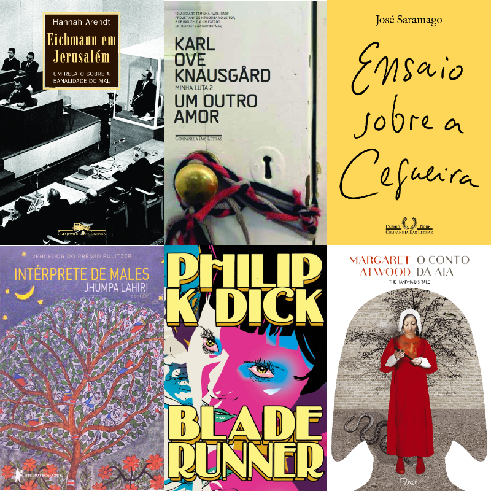

Mesmo tendo sido um ano complicado, um ano muito difícil, 2020 foi um ano de excelentes leituras para mim. Comecei o ano lendo bastante, aproveitando principalmente a ida e volta do trabalho para leitura e, quando possível, lendo um pouco de manhã ou na hora do almoço.

Então veio a pandemia.

De uma hora para outra me vi, como muitos outros, trabalhando de casa, e o primeiro impacto na leitura foi que, sem as horas de deslocamento, ela diminuiu muito. Felizmente, consegui adquirir novos hábitos e ler pela manhã e na hora do almoço passou a ser um costume bem produtivo e uma parte fundamental para me manter mentalmente bem durante esse tempo complicado de isolamento social.

Assim, esse foi o ano que mais li em minha vida, tendo lido livros de diversos tipos e temas: livros de filosofia, de história, de ficção, de contos, de política, de tecnologia. E por toda essa variedade foi difícil escolher quais os melhores que li em 2020, mas aqui segue a lista, ordenada apenas pelo momento em que li, como venho fazendo nos últimos anos.

---

## Ensaio Sobre a Cegueira - José Saramago

Sim, nunca havia lido Saramago. E por isso, fui direto em seu livro mais famoso. E que livro incrível! Me vi preso na história, na forma de escrita totalmente diferente do autor, e o livro acabou com uma sensação triste, pois não queria que acabasse, mesmo que em diversos momentos, a natureza terrível do homem cause raiva ao longo da narrativa.

**Ensaio Sobre a Cegueira** foi um prenúncio para a pandemia. Li ele um pouco antes de as notícias do coronavírus começarem a estourar. No livro, há uma doença misteriosa, que vai deixando as pessoas cegas. Mas não uma cegueira comum, pois ela não é escura, e sim toda branca. As primeiras vítimas são colocadas em uma espécie de asilo, totalmente isoladas do mundo e vigiadas pelo exército. Entre elas há a mulher de um médico, que se finge de cega para acompanhar seu marido.

Talvez não seja uma leitura tão fácil devido aos grandes parágrafos de Saramago, sua estranha divisão para jogar os diálogos no meio de frases comuns, mas mesmo assim tudo parece se encaixar. O livro possui muitos pontos interessantes e por isso não comentarei mais aqui, senão ao invés de falar de outros livros, nos deteremos apenas nesse.

Se posso dar uma grande recomendação dessa lista, é essa: leia **Ensaio Sobre a Cegueira**.

## Um Outro Amor - Karl Ove Knausgård

Esse é o segundo livro da série **Minha Luta** do escritor norueguês e mais uma vez foi uma leitura incrível. Talvez um pouco mais lenta que o primeiro livro, mas ainda assim, não consegui parar de ler.

Nessa série de livros, que é classificada como "autoficção", que mistura uma espécie de autobiografia com ficção, o autor conta fatos da sua vida em diferentes momentos, mas dessa vez focado em seus relacionamentos com a primeira e a segunda esposa, e também sobre o nascimento e criação dos filhos.

A escrita de **Karl Ove Knausgård** é algo fascinante, que prende, que nos faz identificar com várias das situações vividas por ele. Como ele mesmo conta no livro, um amigo dele falava que ele tinha talento para escrever de forma bela até uma ida ao banheiro. E realmente é assim. À medida que ele narra pensamentos, histórias, problemas, tudo de uma maneira bela, parece haver uma simbiose com o autor, como se nós mesmos estivéssemos vivendo o que ele narra, como se aquelas fossem situações parecidas com situações que vivemos em nossas vidas.

Em 2020 saiu o sétimo e último volume da série no Brasil. Espero ler pelo menos mais dois livros dela em 2021.

## Intérprete de Males - Jhumpa Lahiri

Durante o tempo que assinei a **Tag Curadoria**, recebi muitos livros de escritores que não conhecia e que se revelaram boas surpresas. **Intérprete de Males** é um livro de contos escrito por uma escritora inglesa, criada nos Estados Unidos e filha de indianos, e foi uma dessas surpresas.

Desde sempre adoro ler contos e a forma com que **Jhumpa Lahiri** escreve os seus muito me agradou. É uma escrita leve, acessível, que ao mesmo tempo traz uma carga emocional e real para seus personagens.

Os contos desse livro narram histórias de indianos ou descendentes de indianos que moram ou foram criados nos Estados Unidos e acabam sendo uma aula de cultura sobre esse povo, suas dificuldades, tanto em seus países de origem, como também as dificuldades daqueles que moram nos Estados Unidos.

Ao mesmo tempo, nos deparamos com problemas comuns a todos, como se sentir fora de seu lugar, não conseguir compreender algo, ou não ser compreendido.

Esse livro foi a maior surpresa literária que tive no ano.

## Eichmann em Jerusalém - Hannah Arendt

Esse excelente livro da filósofa **Hannah Arendt** é um misto de jornalismo, com história e filosofia. Enviada por uma revista americana, Arendt vai acompanhar o julgamento do nazista Eichmann em Jerusalém, após sua captura na Argentina.

No livro, ela narra boa parte da história do Holocausto e de Eichmann, posicionando ele nessa história, desde como ele entrou no partido nazista, até ser responsável pelo transporte de centenas de milhares de judeus para a morte, assim como a forma em que o julgamento se desenrola.

Além do relato histórico e jornalístico, Hannah Arendt também faz uma avaliação filosófica sobre a situação, falando da banalidade do mal. Recomendo o livro tanto para quem quer saber mais de história, quanto para quem quer conhecer um pouco da filosofia de Arendt.

## O Mundo se Despedaça - Chinua Achebe

Mais um livro que foi enviado pela **Tag Curadoria**, e mais uma excelente experiência de leitura. A Tag me proporcionou ler livros que provavelmente nunca chegaria a ler, como esse próprio.

**Chinua Achebe** é um escritor nigeriano e nesse livro de ficção ele conta a história de um guerreiro em uma tribo na Nigéria, de forma que acompanhamos os costumes e as tradições da região. O guerreiro Okonkwo é uma figura proeminente e respeitada em sua tribo, mas tudo muda após a morte de um jovem capturado e mais ainda com a chegada do homem branco.

A obra possui uma leveza de se ler, ao mesmo tempo que há bastante tensão. A escrita de Achebe é leve e faz com que consigamos manter um bom ritmo de leitura.

Depois desse livro, ele escreveu mais dois, fechando uma trilogia, mas infelizmente não os li ainda.

## O Conto da Aia - Margaret Atwood

Há bastante tempo, **O Conto da Aia** estava em minha fila de leitura e em 2020 finalmente consegui o ler. O livro está bastante em alta por causa da série de TV e recentemente a autora publicou uma espécie de continuação.

Na obra, acompanhamos a vida de Offred, uma aia, em um Estados Unidos transformado, agora chamado de Gilead e governado como uma teocracia cristã ultra-conservadora. As aias são mulheres capazes de gerar filhos e que são designadas para casas de famílias importantes, onde são usadas para engravidarem dos Comandantes, pois a maioria das pessoas tornaram-se inférteis.

Li em inglês e demorei um pouco para pegar o ritmo, mas a partir de certo momento não consegui parar mais. A obra é excelente e deixa bastante coisa em aberto; coisas que ficamos apenas a imaginar que caminho levaram. Além da trama em si, muitos temas importantes em nossa sociedade são levantados, apesar de o livro ter sido escrito na década de 80.

Além de muito recomendar o livro, vale bastante ver a série de TV também.

## Androides Sonham Com Ovelhas Elétricas? - Philip K. Dick

Mais um livro que há anos está na minha lista de leitura. Esse livro, que deu origem ao filme **Blade Runner**, é uma das maiores obras clássicas da ficção científica. Nele acompanhamos o caçador de recompensas Rick Deckard em busca de seis androides fugitivos.

O livro é excelente, a escrita de **Philip K. Dick** prende, é contagiante. Ao mesmo tempo, achei o livro mais profundo e filosófico do que o filme. Há críticas a diversos aspectos da sociedade, e também de religião. Além disso, é uma obra de fácil leitura, bastante acessível

Leitura fundamental e totalmente recomendada para quem gosta de ficção científica.

---

 

Espero ter em 2021 um ano tão bom em termos literários como 2020, mas espero também um ano muito melhor para o mundo, com vacinas e remédios para a Covid-19.

Abaixo seguem os links para as listas dos anos anteriores:

- [Melhores Livros que Li em 2019](melhores-livros-2019)

- [Melhores Livros que Li em 2018](melhores-livros-2018)

- [Melhores Livros que Li em 2017](melhores-livros-2017)
