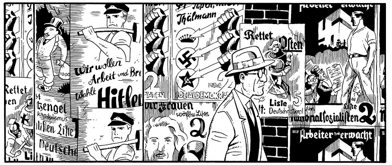

A leitura é uma eterna fonte de aprendizados. Mesmo lendo ficção, é possível aprender, seja sobre a psique humana, seja sobre questões da humanidade, seja história. Dois gêneros literários que muito me agradam e com o qual aprendo bastante sobre história e outras culturas são biografias e romances históricos. E assim como aprendo ao ler livros desse tipo, também aprendo lendo quadrinhos, afinal, quadrinhos são sim um gênero literário, mesmo que muitas pessoas ainda carreguem diversos preconceitos contra esse meio.

Por isso deixo aqui recomendação de três quadrinhos, bem diferentes entre si, mas leituras excelentes, com os quais aprendi mais sobre história e cultura. Cada um foi feito por artistas diferentes, retratando diferentes países e com diferentes abordagens, mas todos cercados pela história do século XX.

## Berlim, de Jason Lutes

Jason Lutes é americano, não alemão, mas o trabalho que ele faz ao recriar a Berlim dos fins da República de Weimar é incrível. Berlim não é um quadrinho fácil de se ler: tem muitos personagens, muitas tramas, e muito texto se compararmos com o estilo da maioria dos quadrinhos modernos; mas é uma leitura que vale o esforço.

Nessa saga de mais de 500 páginas, acompanhamos vários personagens em Berlim no final dos anos 1920, sendo que dois deles abrem a história e nos acompanham pela maior parte da obra: a jovem Marthe, que deixa sua vida de pequena burguesa em Colônia para estudar artes em Berlim, e Kurt Severing, um jornalista de meia idade de um jornal da cidade.

Ao longo da obra acompanhamos a força de Berlim como capital cultural, ao mesmo tempo que a decadência e a pobreza tomam conta de várias camadas da população. Vemos as brigas de rua entre nazistas e comunistas, a perseguição aos judeus, a vida dura de trabalhadores pobres, manifestações políticas, a queda da República de Weimar e a ascensão dos nazistas. Tudo isso nos mostrado na bela arte em preto e branco de Jason Lutes, que nos traz personagens com expressões marcantes e também diversos detalhes dos ambientes.

A leitura de Berlim me lembrou um pouco a leitura da trilogia O Século, de Ken Follet, na qual através da vida de vários personagens fictícios, acompanhamos o desenrolar de diversos fatos históricos. Como falei, não é uma leitura fácil, é uma leitura para se fazer devagar, sem pressa, mas que é totalmente recompensadora.

## Persépolis, de Marjane Sartrapi

Persépolis é um quadrinho lançado na França no início dos anos 2000, escrito e desenhado por Marjane Sartrapi, um quadrinista de origem iraniana. Nele acompanhamos parte de sua vida, da infância ao início da sua vida adulta, no Irã, nos anos da Revolução Islâmica.

Diferente de Berlim, Persépolis é uma obra autobiográfica, que através de diversos capítulos e situações, conta a história da autora segundo ela própria. Através desses relatos, que são de fácil leitura e compreensão, vivenciamos como ela, sua família, seu círculo social e todo seu país, foi afetado pela Revolução Islâmica no Irã, e também como o regime que até hoje governa surgiu e evoluiu.

É um quadrinho muito interessante e bem acessível para quem não está acostumado ao gênero. Além disso, há também um filme animado baseado na obra e dirigido também pela própria Marjane Sartrapi.

## A Arte de Charlie Chan Hock Chye, de Sonny Liew

Dos três quadrinhos que recomendo aqui, A Arte de Charlie Chan Hock Chye é o mais "diferente". É uma espécie de autobiografia em quadrinhos, só que de um quadrinista fictício, chamado Charlie Chan Hock Chye. Através de sua história e de seus quadrinhos, que são inseridos dentro da obra maior, como exemplos de HQs escritas por ele, acompanhamos a história de Cingapura, desde a luta por sua independência do Reino Unido, até o avanço mais moderno do pequeno país como um grande centro de comércio mundial. Charlie Chan, o quadrinista fictício, contando um pouco sobre sua vida e as dificuldades para viver como quadrinista, nos mostra situações que também nos dão mais contexto da cultura e história cingapurianos.

Para exemplificar um pouco a dinâmica dessa obra, as primeiras partes dela reproduzem o que seriam as primeiras histórias desenhadas por Charlie Chan, ainda adolescente, em que um menino e seu robô se encontram no meio da convulsão social que rola pela difícil relação com os colonizadores britânicos.

Gostei muito de A Arte de Charlie Chan Hock Chye, tanto pela dinâmica diferente da obra, que gerou um certo estranhamento no início, mas logo foi superada, quanto pela arte de Sonny Lew, e também pelos diversos fatos sobre a história e cultura de Cingapura que eu não conhecia.

## Concluindo

Essas são apenas três recomendações de excelentes HQs que juntas trazem um conhecimento de história e de cultura, mas existem diversas outras que não são apenas leituras divertidas, mas que muito nos ajudam a aprender. Se você nunca leu quadrinhos, recomendo fortemente ler Maus (se já leu quadrinhos, mas nunca leu Maus, vá ler também), que já é um dos maiores clássicos da nona arte. Outras recomendações que posso deixar na linha de HQs que abordam temas de história e sociedade são os trabalhos de Joe Sacco e o famoso Árabe do Futuro.

Até a próxima!